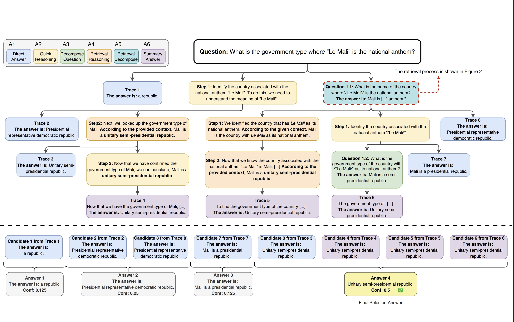
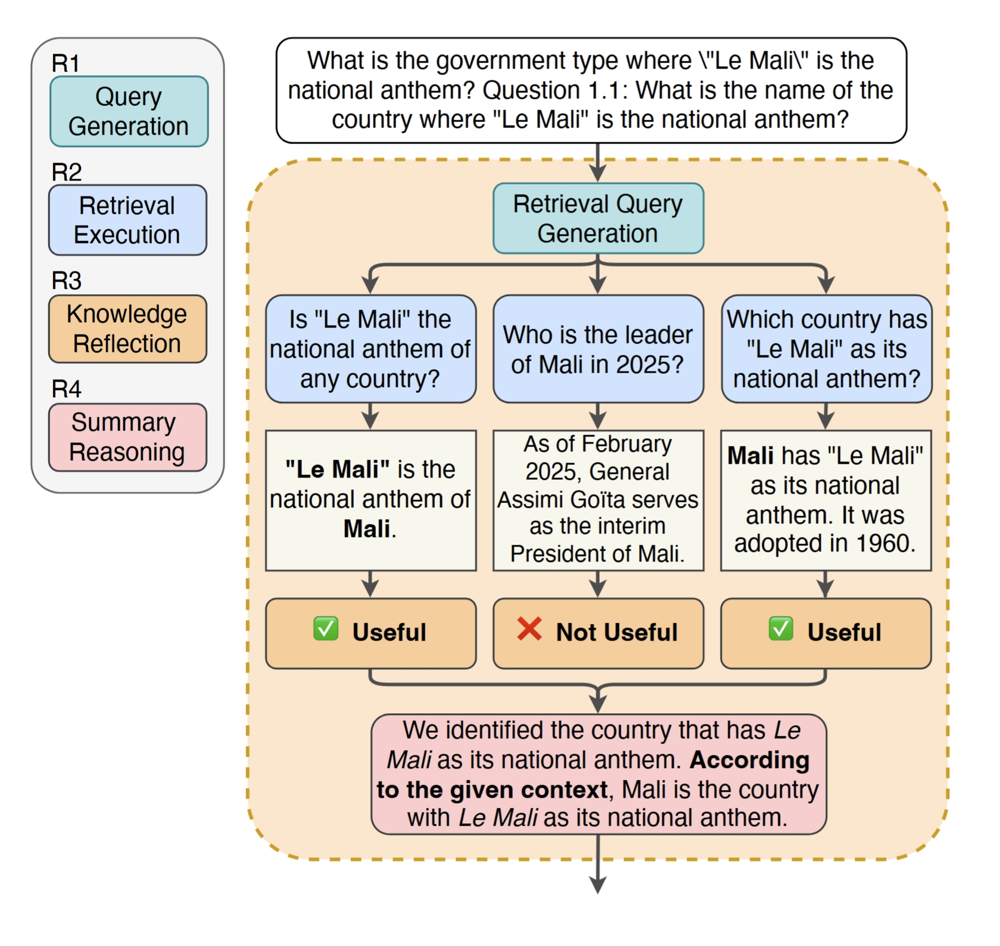
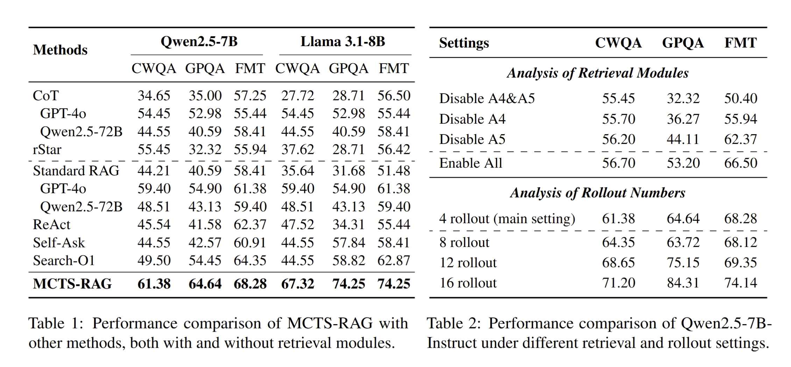

<div align="center">
  <h1 align="center">MCTS-RAG</h1>
  <p align="center">
    Enhance Retrieval-Augmented Generation with Monte Carlo Tree Search
  </p>
  <p align="center">
    A novel approach that enhances the reasoning capabilities of small language models (SLMs) on knowledge-intensive tasks by integrating retrieval-augmented generation (RAG) with Monte Carlo Tree Search (MCTS).
  </p>
</div>

<p align="center">
  <a href="https://arxiv.org/pdf/2503.20757"></a>
  
</p>

<div align="center">
  <b>🔥 Our work has been accepted to EMNLP Findings 2025! The paper is now available on <a href="https://arxiv.org/pdf/2503.20757" style="color:#b31b1b;">arXiv</a>. ✨</b>
</div>


## Intro 

We introduce MCTS-RAG, a novel approach that enhances the reasoning capabilities of small language models (SLMs) on knowledge-intensive tasks by integrating retrieval-augmented generation (RAG) with Monte Carlo Tree Search (MCTS).

<p align="center">
  
</p>
Unlike conventional RAG methods that retrieve and generate sequentially, MCTS-RAG dynamically refines both retrieval and reasoning through an iterative decision-making process. The model first leverages MCTS to explore multiple reasoning paths, strategically incorporating retrieval to improve factual accuracy. Retrieved information is then evaluated within the reasoning process, ensuring only high-confidence knowledge contributes to the final answer.
<p align="center">
  
</p>
This integration of structured reasoning and adaptive retrieval reduces hallucinations and improves response consistency. Experimental results on ComplexWebQA, GPQA, and FoolMeTwice demonstrate that MCTS-RAG enables 7B-scale models to achieve performance comparable to frontier LLMs like GPT-4o, setting a new standard for reasoning in small-scale models.

## Prerequisites

- Python 3.10
- CUDA 12
- newest PyTorch
- newest `transformers`
- newest `vllm`

## Usage

### MCTS-RAG Generator

Here is an example to run MCTS-RAG generator:

```bash
bash scripts/run_gsm8k_generator.sh
```

The script `run_gsm8k_generator.sh` includes several configurable parameters:
- `--dataset_name`: Name of the dataset.
- `--test_json_filename`: Filename for the test JSON (default: test_all).
- `--model_ckpt`: Path to the model checkpoint.
- `--note`: Additional note to mark the output folder. Without further arguments, the generator output folder will be `./run_outputs/<dataset_name>/<model_ckpt>/<execute_time>---[<note>]`
- `--num_rollouts`: Number of rollouts (default: 16).

Make sure to adjust these parameters according to your requirements.

### MCTS-RAG Discriminator

Here is an example to run rStar discriminator:

```bash
bash scripts/run_gsm8k_discriminator.sh
```

The script `run_gsm8k_discriminator.sh` includes several configurable parameters:

- `--root_dir`: Path of evalution result folder.
- `--dataset_name`: Name of the dataset.
- `--note`: Additional note to mark the output folder. Without further arguments, the discriminator output folder will be `<root_dir>/dis_<execute_time>---<note>`

## Results

Experiments show that our approach outperforms baselines on CWQA, GPQA, and FMT, achieving 20%+ gains on CWQA, 15%+ on GPQA, and 10%+ on FMT with LLaMA 3.1-8B. By refining retrieval and verification, it enhances factual accuracy, minimizes hallucinations, and sets a new benchmark for complex reasoning tasks.

<p align="center">
  
</p>


## Citation

If you find our work helpful, please consider citing it:
```bibtex
@misc{hu2025mctsragenhancingretrievalaugmentedgeneration,
      title={MCTS-RAG: Enhancing Retrieval-Augmented Generation with Monte Carlo Tree Search}, 
      author={Yunhai Hu and Yilun Zhao and Chen Zhao and Arman Cohan},
      year={2025},
      eprint={2503.20757},
      archivePrefix={arXiv},
      primaryClass={cs.CL},
      url={https://arxiv.org/abs/2503.20757}, 
}
```

